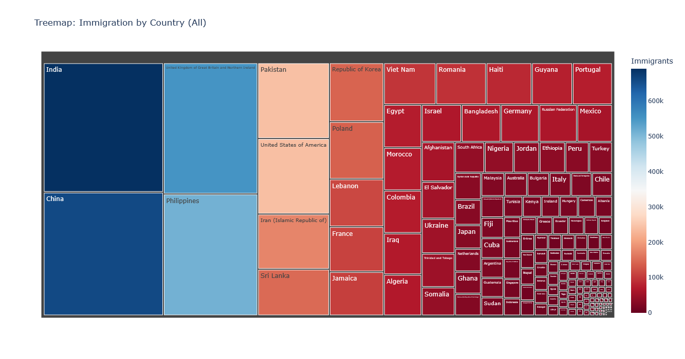

# -data-analysis-in-python-for-immigration-statistics-to-Canada-by-country-of-origin-from-1980-to-2013
 data analysis in python for immigration statistics to Canada using pandas plotly matplotlib, dash, and flask
# Advanced-Pandas-Techniques-for-Data-Processing-and-Performance
By working with real-world data, I’ll demonstrate how Pandas can efficiently handle and analyze complex, multi-file datasets typically encountered in data science projects.you’ll find it makes handling structured data much easier. It gives you flexible, intuitive tools to work with even the most complex datasets.

# How to run?
### STEPS:

Clone the repository

```bash
git clone https://github.com/jamshedfarzandpk/-data-analysis-in-python-for-immigration-statistics-to-Canada-by-country-of-origin-from-1980-to-2013.git
```
### STEP 01- Create a conda environment after opening the repository

```bash
conda create -n dashboard python=3.12 -y
```

```bash
conda activate dashboard
```

### STEP 02- install the requirements
```bash
pip install -r requirements.txt --use-pep517

```
#
### STEP 03- run the following command
```bash
python main.py

```

### STEP 05- Screenshots of the app results:
Screenshot of the app results after running the main.py file:
1.after reading the xls file and creating the plots


### STEP 06- Screenshots of the all.py results:
Screenshot of the app results after running the all.py file:
1.after reading the xls file and creating the plots and result in html file . you can also see the plots below in the html files:



### STEP 07- Screenshots of the dashboard.py results:
Screenshot of the app results after running the dashboard.py file:
1.after reading the xls file and creating the plots using dash and flask and result in dashboard:


