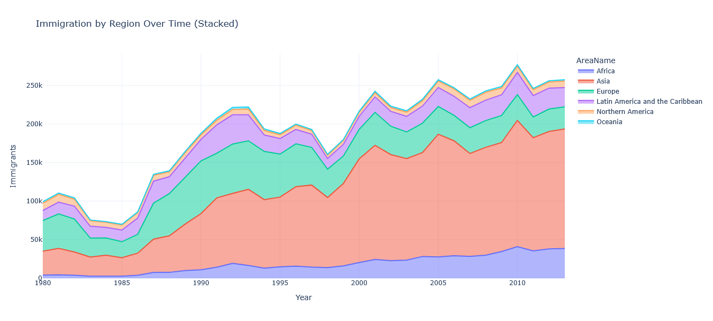

# data analysis in python for immigration statistics to Canada Immigration Trends Dashboard
Interactive Analysis of Immigration to Canada (1980–2013)
# Executive Summary
This dashboard provides a comprehensive, interactive analysis of immigration to Canada from 1980 to 2013, based on official government data covering 195+ countries across all global regions. The analysis reveals key trends, top source countries, regional shifts, and development-status patterns that shaped Canada’s demographic landscape over three decades.
Key insights include the dominance of Asian immigration (led by India, China, and the Philippines), the steady rise of developing-world immigrants, and a notable shift in regional origins from Europe to Asia post-1990.

# Business Problem
Canada relies on immigration to sustain economic growth, address labor shortages, and support an aging population. However, policymakers, researchers, and service providers often lack accessible, visual, and interactive tools to explore historical immigration patterns. This limits data-driven decision-making in areas such as:

* Settlement service planning
* Economic integration programs
* Regional development strategies
* Policy evaluation and forecasting

This project addresses that gap by transforming raw immigration data into an intuitive, web-based dashboard.

# Methodology
* ### Data Source:
Official dataset: "Canada by Citizenship (2)" from Immigration, Refugees and Citizenship Canada (IRCC), covering 1980–2013.
* ### Data Processing:
Loaded and cleaned using Pandas
Reshaped from wide to tidy (long) format for analysis
Removed irrelevant entries (Unknown, World)
Aggregated by country, region, sub-region, and development status
* ### Visualization & Deployment:
Built 10+ interactive charts using Plotly
Designed a responsive Flask/Dash web application
Deployed as a single-page dashboard with KPIs, trends, and regional breakdowns
* ### Key Metrics:
Total immigrants per year
Top source countries
Regional contribution (Asia, Europe, Africa, etc.)
Developed vs. Developing world comparison
Year-over-year growth rates
# Skills & Technologies
* Data Analysis      =>  Python, Pandas, NumPy
* Data Visualization => Plotly, Dash
* Web Framework      => Flask (via Dash)
* Data Handling      => Excel (.xlsx) parsing, data cleaning, aggregation
* Deployment         => Local web server (production-ready for cloud deployment)

# Results & Business Recommendations
**Total immigrants (1980–2013): 6,597,563**
**Top 3 source countries:**
* United Kingdom (582,267) – dominant early period
* India (535,544) – fastest-growing post-2000
* China (489,845) – steady increase since 1990s

**Asia surpassed Europe** as the top region in the **mid-2000s**

**70%+ of immigrants** came from **developing regions**

**Peak immigration year: 2010** (285,731 immigrants)

**Business Recommendations:**

* **Targeted Settlement Services:**
Scale language, housing, and job-matching programs in regions with high concentrations of newcomers from India, China, and the Philippines.
* **Regional Economic Integration:**
Partner with provinces to align immigration streams with local labor market needs, especially in tech, healthcare, and skilled trades.
* **Policy Continuity:**
Maintain or expand pathways for economic-class immigrants from developing regions, given their strong growth trajectory and economic contribution.
* **Historical Benchmarking:**
Use this dashboard as a baseline to evaluate the impact of future immigration policy changes (e.g., Express Entry reforms, refugee resettlement).
# Next Steps
* Deploy to cloud (e.g., Heroku, AWS, Azure) for public access
* 📈 Add forecasting models (ARIMA, Prophet) to project future trends
* 🌐 Integrate geospatial maps using Plotly Mapbox or Folium
* 📅 Update with post-2013 data (2014–2023) for a complete modern view
* 🤝 Link to economic outcomes (employment, income, retention) for deeper impact analysis

# How to run at your local?
### STEPS:

Clone the repository

```bash
git clone https://github.com/jamshedfarzandpk/-data-analysis-in-python-for-immigration-statistics-to-Canada-by-country-of-origin-from-1980-to-2013.git
```
### STEP 01- Create a conda environment after opening the repository

```bash
conda create -n dashboard python=3.12 -y
```

```bash
conda activate dashboard
```

### STEP 02- install the requirements
```bash
pip install -r requirements.txt --use-pep517

```
#
### STEP 03- run the following command
```bash
python main.py

```

### STEP 05- Screenshots of the app results:
Screenshot of the app results after running the main.py file:
1.after reading the xls file and creating the plots


### STEP 06- Screenshots of the all.py results:
Screenshot of the app results after running the all.py file:
1.after reading the xls file and creating the plots and result in html file . you can also see the plots below in the html files:




### STEP 07- Screenshots of the dashboard.py results:
Screenshot of the app results after running the dashboard.py file:
1.after reading the xls file and creating the plots using dash and flask and result in dashboard:


